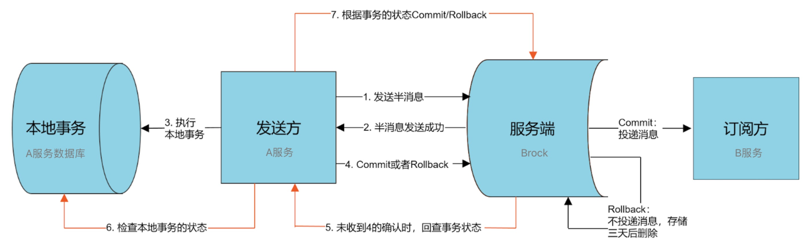

## A SpringBoot Demo Use RocketMQ To Show How Distribute Transaction Works
### To Run This Application, Follow The Steps
step1: Run RocketMq server:
```bash
docker run -d -p 9876:9876 --name rmqserver  foxiswho/rocketmq:server
```
step2: Create broker.conf, find ip in en0 by command ifconfig. add ip in broker.conf
```bash
mkdir /Users/zhuhuiyuan/rmq/conf
vim broker.conf
brokerIP1=192.168.0.103
```
step3: Run RocketMq broker:
```bash
docker run -d -p 10911:10911 -p 10909:10909 --name rmqbroker --link rmqserver:namesrv \
-e "NAMESRV_ADDR=namesrv:9876" \
-e "JAVA_OPTS=-Duser.home=/opt"  \
-e "JAVA_OPT_EXT=-server -Xms128m -Xmx128m -Xmn128m" \
-v /Users/zhuhuiyuan/rmq/conf/broker.conf:/etc/rocketmq/broker.conf \
foxiswho/rocketmq:broker
```
step4: Run RocketMq console:
```bash
docker run --name rmqconsole -p 8180:8080 --link rmqserver:namesrv -e "JAVA_OPTS=-Drocketmq.namesrv.addr=namesrv:9876 -Dcom.rocketmq.sendMessageWithVIPChannel=false" -t styletang/rocketmq-console-ng
```
### This Application Implements Distribute Transaction By Follow Picture
